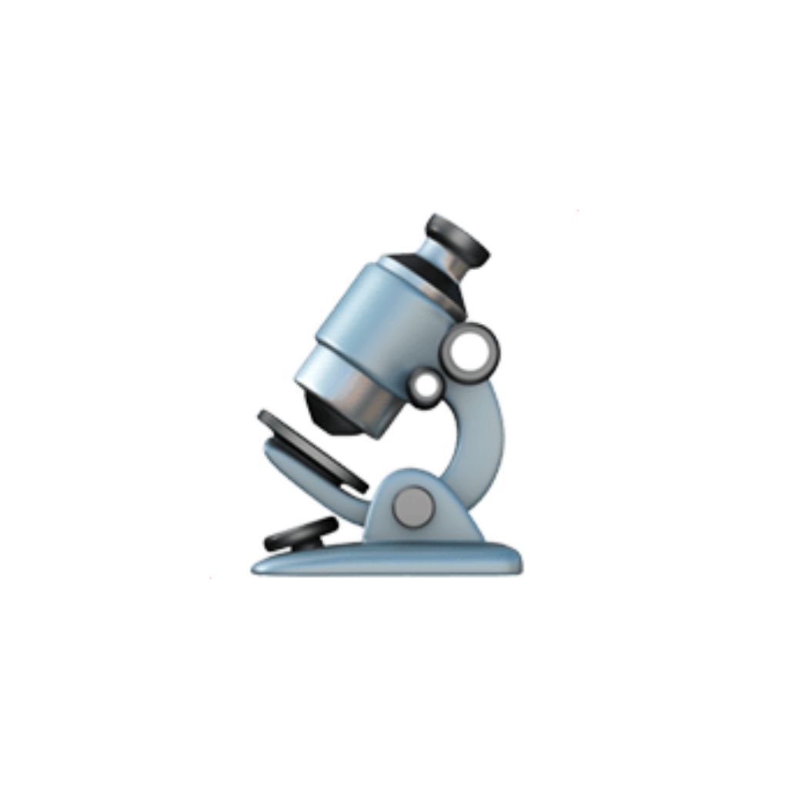
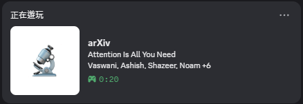

繁體中文 | <a href="README_EN.md">English</a>

<h1> Paper Attention</h1>

# About

讓 Discord Rich Presence 顯示你正在看的 arXiv 論文，透過瀏覽器擴充與本機 helper 完成。

本專案與 arXiv / Cornell 無關，僅透過公開的 arXiv 網頁資訊運作。免責聲明：僅供個人／教育用途，與 arXiv / Cornell 無從屬或背書關係；請自備圖示與素材，避免使用第三方商標。

## 安裝與啟動（使用 GUI）
1) 安裝並啟動 Paper Attention

2) 載入瀏覽器擴充
    - Chrome/Edge → Extensions → 開啟「開發人員模式」。
    - 點「Load unpacked」→ 指向 `extension/` 資料夾。
    - 打開任一 arXiv 論文頁面，GUI log 應可看到收到的更新。

## 使用方式
- 保持 Discord 與 helper 執行中。
- 造訪 arXiv 摘要或 PDF 頁面，Rich Presence 會自動更新。
- 按鈕預設開啟，如不需要可在擴充選項中關閉。

## 常見問題
- 沒有更新？確認 helper 終端有 POST 紀錄，且 Discord 已開啟。